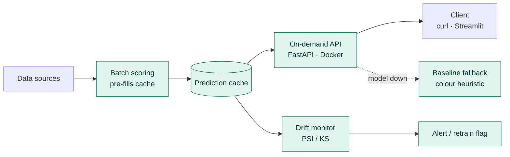

# AvoGrade

Real-time avocado ripeness grading — a computer-vision model wrapped in a full production serving and monitoring stack. Built as an end-to-end system, not a notebook: honest leakage-safe evaluation, a cache-first API with graceful fallback, batch scoring, and drift monitoring that acts on what it detects.

Trained on the [Hass Avocado Ripening Photographic Dataset](https://data.mendeley.com/datasets/3xd9n945v8/1) (478 avocados, ~14.7k photos across ripening).

---

## Architecture



Every stage is built and demonstrated on real data. The API serves cache-first; on a cache miss it runs the model; if the model is unavailable it degrades to a colour-based baseline rather than failing, tagging every response with its `source` (`model` / `cache` / `baseline`).

---

## Results

Evaluated on a **leakage-safe split** (whole fruit held out — see below), on unseen avocados:

| Model | Accuracy | Stage-5 recall |
|---|---|---|
| Majority-class baseline | 0.24 | — |
| From-scratch CNN | 0.63 | 0.05 |
| ResNet18 (transfer learning) | 0.71 | 0.39 |
| ResNet18 + class weighting, 8 epochs | **0.78** | **0.78** |

Two findings matter more than the headline number:

**Errors are almost entirely between adjacent ripeness stages** — the model confuses stage 3 with 4, never 1 with 5. It learned the ripeness ordering; it blurs neighbouring boundaries, which is where human graders disagree too.

**The overripe class was the hard case — and it got fixed.** The from-scratch CNN caught only 5% of stage-5 fruit, collapsing them into stage 4. Transfer learning lifted that to 39%. Adding class-weighted loss and training longer (8 epochs, still climbing) recovered stage-5 recall to **78%**, and cut the stage 4↔5 confusion from 219 misclassified fruit to 81. The evidence suggests the extra epochs did most of the work: the near-1.0 class weights indicate only mild imbalance, so the boundary was learnable — it just needed more training to resolve.

---

## The evaluation is the point

The dataset photographs each physical avocado many times across days. A naive random split scatters photos of the *same fruit* across train and test, so the model can memorise individual avocados and report an inflated score that collapses in production.

AvoGrade splits **by fruit**: whole avocados are assigned to train/val/test, so no fruit appears in more than one split. The reported accuracy is therefore an honest estimate of performance on avocados the model has never seen. This is the single most important design decision in the project.

---

## Production layer (all demonstrated)

- **Cache-first serving** — predictions are content-addressed by image hash; a repeated image returns from cache in ~0 ms instead of re-running the model.
- **Fallback ladder** — model → stale cache → colour baseline → typed error. The service always answers, tagged with its `source`, so prediction quality is always known.
- **Batch scoring** — a job pre-scores images into the cache (~95 img/s) so the API serves cache-hits instead of cold model calls. Runs on a schedule in production.
- **Drift monitoring** — PSI/KS on image statistics (brightness, colour, dark fraction) vs the training distribution. A dimmed batch (simulating a new camera) trips the alert at PSI 12.4 while correctly leaving the colour-ratio feature alone.
- **Alert / retrain** — drift doesn't just get detected; it writes an auditable alert log and flags a retrain. Retraining is human-gated, so the system flags rather than silently retraining.
- **Containerized** — a lean CPU-only Docker image serves the model over HTTP, verified grading photos inside the container.

---

## Project structure

```
src/avograde/
├── config.py          # thresholds, taxonomy, budgets
├── features.py        # shared image statistics
├── data/
│   ├── labels.py      # spreadsheet -> labels, split BY FRUIT
│   ├── dataset.py     # torch Dataset
│   └── splits.py      # leakage-safe splitting
├── models/grader_cnn.py   # CNN + ResNet18 + weighted training loop
├── serving/           # PredictionService, baseline, FastAPI app
├── monitoring/drift.py     # PSI/KS drift detection
├── batch.py           # batch scoring job
├── alerting.py        # drift-triggered alert / retrain flag
├── train.py           # training entry point (computes class weights)
└── eval.py            # confusion matrix + per-class metrics
tests/                 # pytest suite
Dockerfile             # CPU-only serving image
streamlit_app.py       # interactive demo
```

## Quickstart

```bash
python -m venv .venv && source .venv/bin/activate
pip install -e ".[model,serve,dev]"
pytest

# train / evaluate
python -m avograde.train --excel <labels.xlsx> --images <photos/> --arch resnet18 --epochs 8 --out avograder_weighted.pt
python -m avograde.eval  --excel <labels.xlsx> --images <photos/> --model avograder_weighted.pt --arch resnet18

# serve (API)
docker build -t avograde . && docker run -p 8000:8000 avograde
curl -X POST localhost:8000/grade -F "image=@avocado.jpg"

# interactive demo
streamlit run streamlit_app.py
```

## Stack

PyTorch · torchvision · FastAPI · Docker · pandas · NumPy · Streamlit · pytest. Packaged as an installable `src`-layout project with CI running the test suite on every push.

## Limitations & next steps

- Train further — the validation curve was still climbing at 8 epochs, so accuracy likely isn't saturated.
- The remaining stage 4↔5 errors look like genuine visual ambiguity; targeted collection of more overripe examples is the next lever, not more model tuning.
- Route the Streamlit demo through the serving layer so the UI exercises the cache/fallback path directly.
